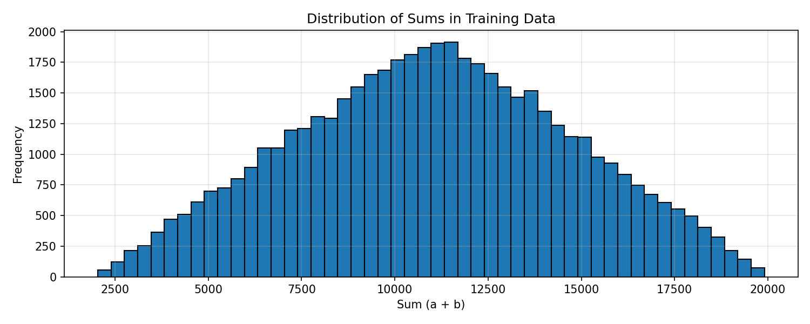
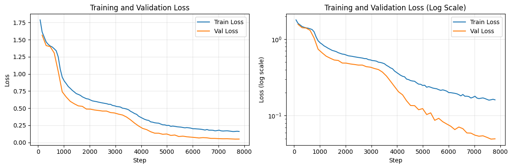
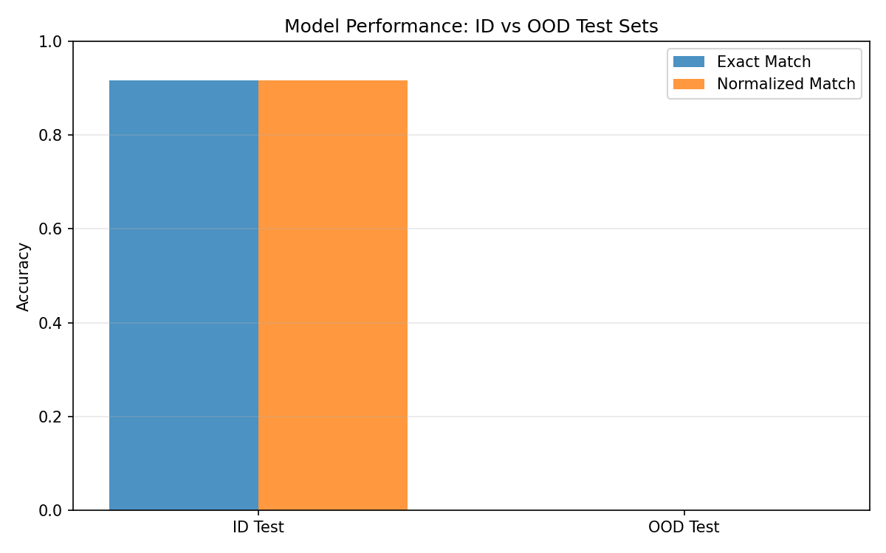

# Learning Addition with a Small Transformer

Isabel MacGinnitie

---

## Task Setup

### Task Definition

- **Task:** Addition of two 4-digit numbers (k=4)
- **Number range:** 1000-9999
- **Sum range:** 2000-19998

### Format

**In-distribution (ID) format:**
```
Input:  "1234 + 5678 ="
Output: "6912"
```

**Out-of-distribution (OOD) format:**
```
Input:  "1 234 + 2 624="
Output: "10652"
```

Spaces are sometimes used as a decimal separator (i.e. sometimes 10^6 is written as as 1 000 000), so I was interested in using that case for the generalizable test. To allow for that test, I chose 4 digit numbers and included spaces in the ID format.

### Tokenizer

I used a character-level tokenizer with a vocabulary of 13 tokens:
- Digits: `0, 1, 2, 3, 4, 5, 6, 7, 8, 9`
- Operators: `+`, `=`
- Separator: ` ` (space)

My intuition here was to just keep it simple.

### Model Architecture

I trained on the GPT-2 transformer with the following specs:

| Parameter | Value |
|-----------|-------|
| Number of layers | 4 |
| Hidden size | 128 |
| Attention heads | 4 |
| Intermediate size | 512 |
| Vocabulary size | 13 |
| Total parameters | ~270K |

This is what Claude suggested for the goal to train in <60 min with the free Colab T4 GPU and with the template's specs.

---

## Data Generation & Splits

### Sampling Distribution

I used uniform sampling because it is simple and standard, since I did not think a more complex sampling method would meaningfully influence my OOD test results.

**Distribution statistics:**
- Sum range: 2,036 to 19,909
- Mean sum: 11,027
- Std deviation: 3,691




### Dataset Sizes

| Split | Size | Purpose |
|-------|------|---------|
| Training | 50,000 | Model learning |
| Validation | 10,000 | Hyperparameter tuning |
| Test (ID) | 10,000 | In-distribution evaluation |
| Test (OOD) | 10,000 | Out-of-distribution evaluation |

### Split Methodology

I wanted to keep training short, while still having a good amount of validation and test data, so I did a 5/1/1(/1 for OOD) split. This ended up training very fast, but had pretty accurate results for ID testing.

---

## Training Details

### Hyperparameters

| Parameter | Value |
|-----------|-------|
| Batch size | 64 |
| Learning rate | 5×10⁻⁴ |
| Optimizer | AdamW (adamw_torch_fused) |
| Epochs | 10 |
| Max sequence length | 512 |
| Warmup ratio | 0.0 (no warmup) |
| Weight decay | 0.0 |
| Gradient accumulation steps | 1 |

### Training Execution

- **Hardware:** Google Colab T4 GPU (16GB)
- **Training time:** 9.09 minutes (545 seconds)
- **Total training steps:** ~7,820 steps

### Training Curves




I originally trained on 20 epochs, which was hilariously too many. I had a bug so had to retrain, so reduced to 10, which was plenty.

---

## Evaluation Design

### Metrics

**Primary metric:** Exact match accuracy- output string matches expected answer exactly

**Secondary metric:** Normalized accuracy- if output matches with whitespace trimmed off. This was in case the OOD test worked, so we could consider `2345`, `2 345`, `23 45`, etc. all correct in this metric.

### Evaluation Splits

#### In-Distribution (ID) Test
- **Format:** Same as training (`"1234 + 5678 ="`)
- **Purpose:** Measure performance on trained format
- **Size:** 10,000 examples

#### Out-of-Distribution (OOD) Test
- **Format:** Spaces within numbers (`"1 234 + 2 624="`)
- **Purpose:** See if it would generalize to 4 digit numbers that use " " as a decimal separator 
- **Size:** 10,000 examples (could definitely started lower since there was 0 accuracy)

---

## Results



### In-Distribution Performance

The model was very good on the ID test set:

| Metric | Accuracy | Correct/Total |
|--------|----------|---------------|
| Exact match | **91.6%** | 9,163/10,000 |
| Normalized | **91.6%** | 9,163/10,000 |

**Sample predictions:**

| Input | Ground Truth | Prediction | Correct |
|-------|--------------|------------|---------|
| 5944 + 3006 = | 8950 | 8950 | ✓ |
| 3852 + 1310 = | 5162 | 5162 | ✓ |
| 3952 + 3207 = | 7159 | 7169 | ✗ |
| 1699 + 8984 = | 10683 | 10683 | ✓ |
| 5861 + 6576 = | 12437 | 12437 | ✓ |

### Out-of-Distribution Performance

The model completely failed on the OOD test set:

| Metric | Accuracy | Correct/Total |
|--------|----------|---------------|
| Exact match | **0.0%** | 0/10,000 |
| Normalized | **0.0%** | 0/10,000 |

**Sample predictions:**

| Input | Ground Truth | Prediction | Correct |
|-------|--------------|------------|---------|
| 8 028 + 2 624= | 10652 | 138 | ✗ |
| 7 448 + 6 783= | 14231 | 591 | ✗ |
| 2 031 + 8 666= | 10697 | 969 | ✗ |
| 3 715 + 9 760= | 13475 | 898 | ✗ |
| 8 167 + 3 135= | 11302 | 187 | ✗ |


---

## Interpretation

The model seemed to train on 4 digit addition pretty easily, with nice loss curves. I thought it was interesting that the OOD sample predictions were all 3 digit numbers, which seem to not be obviously correlated to the correct answer or to a partial sum.

---

## Discussion 
I focused my design choices around the OOD test set. To allow for spaces to be already familiar to the model, I used spaces in the training input/output format. I used standard uniform sampling for the data generation and fairly standard ~70%/15%/15% train/val/test split (not counting the OOD test set in the split).

I had expected the OOD test set to have bad results, but it would be interesting to do a deeper analysis to see if the answers correlate to any combinations of the digits (i.e. if it for "a bcd + e fgh=", the prediction "xyz" is "abc + e", or something like that).

Clearly, what the model learns does not generalize to inputs with decimal seperators, which suggests that it is not learning addition in a human-like, flexible way, but rather memorizing a more brittle relationship between digits' positions.